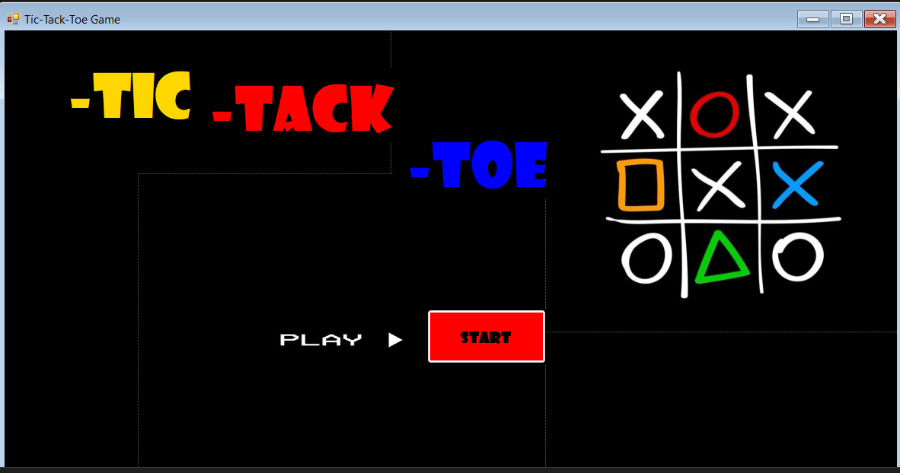
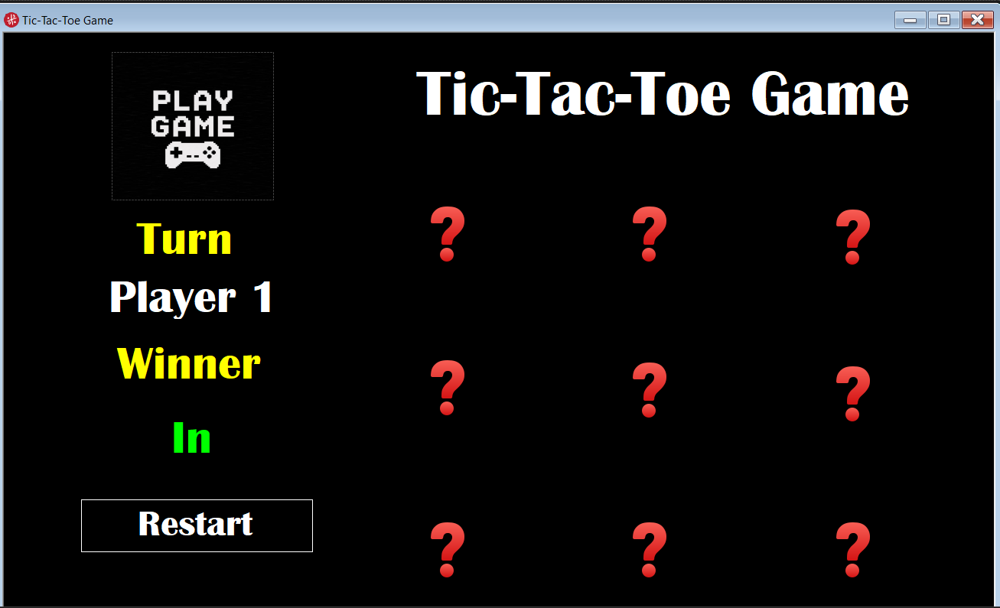

# ❌⭕ Tic Tac Toe Game

A desktop Tic Tac Toe (X O) game built using **C# Windows Forms**. This project demonstrates GUI development, event-driven programming, and game logic implementation through a clean and interactive interface.

---

## ✨ Features

- ❌ Two-player gameplay
- 🎮 Interactive graphical user interface
- 🏆 Automatic winner detection
- 🤝 Draw detection
- 🔄 Restart the game at any time
- 🖱️ Simple and user-friendly design

---

## 🛠️ Technologies Used

- C#
- Windows Forms (.NET Framework)
- Visual Studio

---

## 🎯 Learning Objectives

This project helped me practice:

- Windows Forms development
- Event-driven programming
- Object-Oriented Programming (OOP)
- Game logic implementation
- Conditional statements
- Writing clean and maintainable C# code

---

## 📸 Screenshots

### 🏠 Main Form



### 🎮 Play Form



---

## 🚀 How to Run

1. Clone the repository:

```bash
git clone https://github.com/moe-stack24x/Tic-Tac-Toe-Game.git
```

2. Open the solution in **Visual Studio**.

3. Build and run the project.

---

## 👨‍💻 Author

**Mohamed Idris**

- GitHub: https://github.com/moe-stack24x
